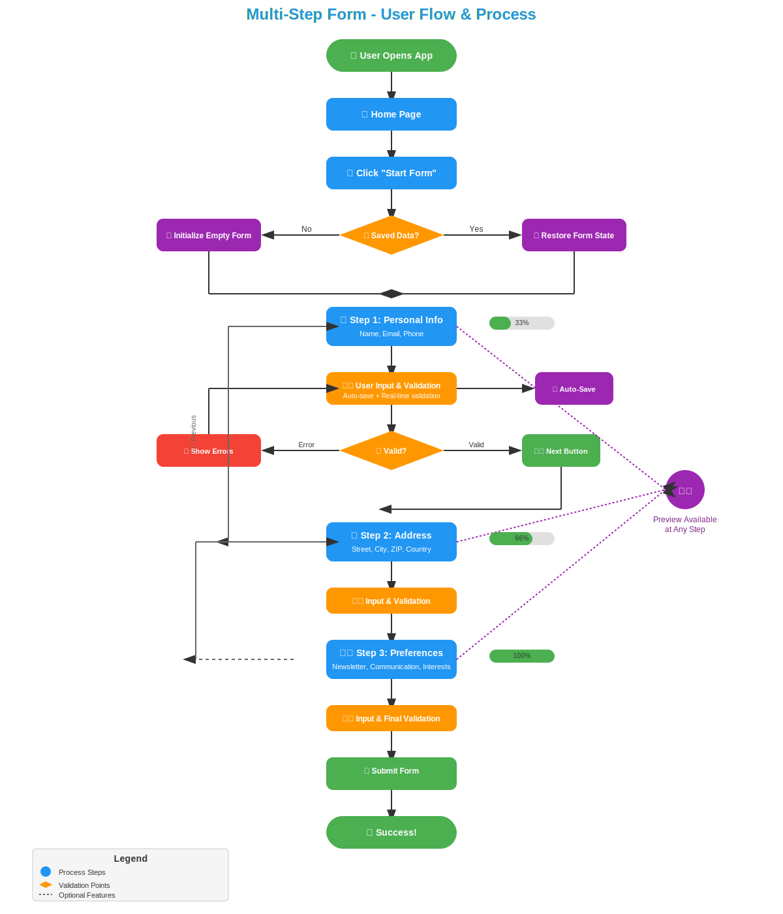

# Multi-Step Form Implementation Guide

## 📋 Overview

This is a comprehensive, production-ready multi-step form implementation in Flutter using Riverpod for state management. The system follows enterprise-level architecture patterns with proper separation of concerns, robust error handling, and excellent user experience.

## 🎯 Key Features

- ✅ **Three-step form flow**: Personal Info → Address → Preferences
- 🔄 **Real-time validation** with async support (email uniqueness check)
- 💾 **Auto-save functionality** with 2-second debouncing
- 📱 **Responsive UI** with progress indicators and step navigation
- 🛡️ **Robust error handling** with user-friendly messages
- 🔄 **State recovery** - form survives app restarts
- 👁️ **Form preview** modal for data review
- 🎨 **Modern Material Design** UI components


// add svg image 
## user flow and process diagram



## screan shots
     


## 🏗️ Architecture Overview

### Layer Structure

```
┌─────────────────────────────────────┐
│              UI Layer               │  ← Widgets, Forms, Navigation
├─────────────────────────────────────┤
│         State Management            │  ← Riverpod, Form State
├─────────────────────────────────────┤
│         Business Logic              │  ← Validation, Navigation Rules
├─────────────────────────────────────┤
│            Services                 │  ← Persistence, API Calls
└─────────────────────────────────────┘
```

### Key Components

#### 🎨 UI Layer
- **MultiStepForm**: Main container widget managing the entire form flow
- **Step Widgets**: Individual form steps (PersonalInfoStep, AddressStep, PreferencesStep)
- **Navigation Components**: Progress bars, step indicators, next/previous buttons
- **Preview Sheet**: Modal for reviewing form data

#### 🏗️ State Management (Riverpod)
- **FormNotifier**: Central controller managing all form operations
- **FormState**: Immutable state containing current step, data, validation results
- **Data Models**: Strongly-typed, immutable data structures
- **Providers**: Dependency injection for services and validators

#### ⚙️ Business Logic
- **Validation System**: Multi-layered validation with async support
- **Step Registry**: Configuration and navigation rules for form steps
- **Navigation Guards**: Prevents invalid step transitions

#### 🔧 Services
- **Persistence Service**: Auto-save and data recovery using SharedPreferences
- **Submission Service**: API integration for form submission
- **Auto-save Timer**: Debounced saving mechanism

## 📝 Form Steps

### Step 1: Personal Information
**Required Fields:**
- First Name
- Last Name
- Email (with format validation + async uniqueness check)
- Phone Number

**Features:**
- Real-time field validation
- Email uniqueness verification (simulated API call)
- Auto-save after user input

### Step 2: Address Information
**Required Fields:**
- Street Address
- City
- ZIP Code
- Country

**Features:**
- Standard field validation
- Geographic data validation ready for extension

### Step 3: Preferences
**Required Fields:**
- Communication Method (dropdown)

**Optional Fields:**
- Newsletter subscription (toggle)
- Interests (multi-select chips)

**Features:**
- Complex form controls
- Multi-value selection handling

## 🔄 User Flow

```
1. User opens app
   ↓
2. Check for saved data
   ├─ Yes → Restore form state
   └─ No → Initialize empty form
   ↓
3. Step 1: Personal Info
   ├─ User enters data
   ├─ Real-time validation
   ├─ Auto-save (2s delay)
   └─ Next button (if valid)
   ↓
4. Step 2: Address
   ├─ Similar validation flow
   ├─ Previous/Next navigation
   └─ Progress tracking
   ↓
5. Step 3: Preferences
   ├─ Final step validation
   └─ Submit button
   ↓
6. Form Submission
   ├─ Final validation check
   ├─ API submission
   ├─ Success confirmation
   └─ Clear saved data
```

## 🚀 Getting Started

### Prerequisites

```yaml
dependencies:
  flutter: sdk
  flutter_riverpod: ^2.4.0
  shared_preferences: ^2.2.0
```

### Installation

1. **Add Dependencies**
   ```bash
   flutter pub add flutter_riverpod shared_preferences
   ```

2. **Copy Implementation**
   - Copy the complete code into your Flutter project
   - The code is self-contained and ready to run

3. **Run the App**
   ```bash
   flutter run
   ```

## 🧪 Testing the Features

### Validation Testing
- **Email validation**: Try invalid email formats
- **Async validation**: Use `taken@example.com` to test uniqueness failure
- **Required fields**: Leave fields empty to see validation errors

### Auto-save Testing
1. Fill out part of the form
2. Close the app (hot restart or full restart)
3. Reopen - data should be restored

### Error Handling Testing
- **Submission error**: Use `error@example.com` to simulate API failure
- **Network issues**: Test with airplane mode
- **Validation errors**: Submit with incomplete data

### Navigation Testing
- Use Previous/Next buttons
- Click on step indicators to jump between steps
- Test navigation guards (can't skip required steps)

## 📊 Data Flow

### Input Flow
```
User Input → TextEditingController → FormNotifier → FormState → Auto-save
```

### Validation Flow
```
FormNotifier → Validators → ValidationResult → FormState → UI Update
```

### Navigation Flow
```
User Action → FormNotifier → StepRegistry → Navigation Guards → State Update
```

### Persistence Flow
```
Data Change → Auto-save Timer → Persistence Service → SharedPreferences
```

## 🛠️ Customization Guide

### Adding New Steps

1. **Create Step Enum**
   ```dart
   enum FormStep { personal, address, preferences, newStep }
   ```

2. **Add Data Model**
   ```dart
   class NewStepData {
     final String field1;
     final String field2;
     // ... constructor, copyWith, toJson, fromJson
   }
   ```

3. **Create Validator**
   ```dart
   class NewStepValidator extends FormValidator<NewStepData> {
     @override
     ValidationResult validate(NewStepData data) {
       // Validation logic
     }
   }
   ```

4. **Register Step**
   ```dart
   // Add to StepRegistry._steps map
   FormStep.newStep: StepConfig(
     step: FormStep.newStep,
     title: 'New Step',
     subtitle: 'Description',
     icon: Icons.star,
     dependencies: [FormStep.address], // Previous steps required
   ),
   ```

5. **Create Widget**
   ```dart
   class NewStepWidget extends ConsumerWidget {
     // Implementation
   }
   ```

### Customizing Validation

#### Adding Custom Validators
```dart
class CustomValidator extends FormValidator<YourDataType> {
  @override
  ValidationResult validate(YourDataType data) {
    // Your validation logic
    return ValidationResult.valid(); // or invalid
  }
  
  @override
  Future<ValidationResult> validateAsync(YourDataType data) async {
    // Async validation (API calls, etc.)
  }
}
```

#### Adding Cross-Step Validation
```dart
// In FormNotifier
bool validateCrossStepDependency() {
  final personal = state.data.personal;
  final address = state.data.address;
  
  // Example: Email domain should match country
  if (personal.email.endsWith('.uk') && address.country != 'UK') {
    return false;
  }
  return true;
}
```

### Customizing Auto-save

```dart
// Change auto-save delay
Timer(const Duration(seconds: 5), () async {
  // Custom save logic
});

// Add custom save conditions
void _scheduleAutoSave() {
  if (shouldSave()) {
    _autoSaveTimer?.cancel();
    _autoSaveTimer = Timer(customDelay, saveLogic);
  }
}
```

## 🎨 UI Customization

### Theme Customization
```dart
// Custom colors for form steps
final stepColors = {
  FormStep.personal: Colors.blue,
  FormStep.address: Colors.green,
  FormStep.preferences: Colors.purple,
};
```

### Custom Step Indicators
```dart
Widget buildStepIndicator(FormStep step, bool isActive, bool isCompleted) {
  return Container(
    decoration: BoxDecoration(
      color: isActive ? activeColor : completedColor,
      shape: BoxShape.circle,
    ),
    child: Icon(getStepIcon(step)),
  );
}
```

### Custom Progress Indicators
```dart
Widget buildProgressBar(double progress) {
  return LinearProgressIndicator(
    value: progress,
    backgroundColor: Colors.grey[300],
    valueColor: AlwaysStoppedAnimation<Color>(Theme.of(context).primaryColor),
  );
}
```

## 🔧 Advanced Configuration

### API Integration

```dart
class FormSubmissionService {
  final String baseUrl;
  final http.Client client;
  
  FormSubmissionService({required this.baseUrl, required this.client});
  
  Future<bool> submitForm(FormData data) async {
    final response = await client.post(
      Uri.parse('$baseUrl/submit-form'),
      headers: {'Content-Type': 'application/json'},
      body: jsonEncode(data.toJson()),
    );
    
    if (response.statusCode == 200) {
      return true;
    } else {
      throw Exception('Submission failed: ${response.body}');
    }
  }
}
```

### Custom Persistence

```dart
class CustomPersistenceService extends FormPersistenceService {
  @override
  Future<void> saveFormData(FormData data, FormStep currentStep) async {
    // Custom save logic (SQLite, Hive, Firebase, etc.)
    await customDatabase.save(data);
  }
  
  @override
  Future<(FormData?, FormStep?)> loadFormData() async {
    // Custom load logic
    final data = await customDatabase.load();
    return (data, currentStep);
  }
}
```

### Error Tracking Integration

```dart
// Add to FormNotifier
void _trackError(String error, Map<String, dynamic> context) {
  // Firebase Crashlytics
  FirebaseCrashlytics.instance.recordError(error, null, context: context);
  
  // Custom analytics
  analytics.track('form_error', {
    'error': error,
    'step': state.currentStep.name,
    'user_data': state.data.toJson(),
  });
}
```

## 🧪 Testing

### Unit Tests

```dart
// Test validation logic
test('should validate personal data correctly', () {
  final validator = PersonalDataValidator();
  final data = PersonalData(
    firstName: 'John',
    lastName: 'Doe',
    email: 'invalid-email',
    phone: '123456789',
  );
  
  final result = validator.validate(data);
  expect(result.isValid, false);
  expect(result.fieldErrors['email'], 'Invalid email format');
});

// Test form state management
test('should update form state on data change', () {
  final notifier = FormNotifier(/* dependencies */);
  final personalData = PersonalData(/* valid data */);
  
  notifier.updatePersonalData(personalData);
  
  expect(notifier.state.data.personal, personalData);
});
```

### Widget Tests

```dart
testWidgets('should display validation errors', (WidgetTester tester) async {
  await tester.pumpWidget(
    ProviderScope(
      child: MaterialApp(home: PersonalInfoStep()),
    ),
  );
  
  // Enter invalid email
  await tester.enterText(find.byKey(Key('email_field')), 'invalid');
  await tester.pump();
  
  // Check for error message
  expect(find.text('Invalid email format'), findsOneWidget);
});
```

### Integration Tests

```dart
testWidgets('complete form flow test', (WidgetTester tester) async {
  await tester.pumpWidget(ProviderScope(child: MyApp()));
  
  // Navigate to form
  await tester.tap(find.text('Start Form'));
  await tester.pumpAndSettle();
  
  // Fill Step 1
  await fillPersonalInfo(tester);
  await tester.tap(find.text('Next'));
  await tester.pumpAndSettle();
  
  // Fill Step 2
  await fillAddressInfo(tester);
  await tester.tap(find.text('Next'));
  await tester.pumpAndSettle();
  
  // Fill Step 3 and submit
  await fillPreferences(tester);
  await tester.tap(find.text('Submit'));
  await tester.pumpAndSettle();
  
  // Verify success
  expect(find.text('Success!'), findsOneWidget);
});
```

## 🚀 Performance Optimization

### Widget Rebuilding
- Uses `Consumer` widgets to minimize rebuilds
- Selective state listening with `select`
- Proper widget keys for efficient updates

### Memory Management
- Automatic controller disposal
- Timer cancellation in dispose methods
- Efficient data structures

### Network Optimization
- Debounced validation calls
- Request cancellation support
- Offline capability ready

## 📱 Accessibility

### Screen Reader Support
- Semantic labels on all form fields
- Error announcements
- Navigation instructions

### Keyboard Navigation
- Tab order optimization
- Enter key submission
- Escape key handling

### Visual Accessibility
- High contrast support
- Large text scaling
- Color-blind friendly indicators

## 🔒 Security Considerations

### Data Protection
- No sensitive data in logs
- Secure storage options ready
- Input sanitization

### Validation Security
- Server-side validation recommended
- XSS prevention in text inputs
- SQL injection prevention

## 📈 Analytics Integration

```dart
// Track form interactions
void trackFormEvent(String event, Map<String, dynamic> properties) {
  analytics.track(event, {
    'form_step': state.currentStep.name,
    'form_completion': state.progress,
    'validation_errors': state.validationResults.length,
    ...properties,
  });
}

// Usage in FormNotifier
void goToNextStep() {
  trackFormEvent('step_completed', {'step': state.currentStep.name});
  // ... rest of implementation
}
```

## 🌐 Internationalization

```dart
// Add to localization files
{
  "personal_info_title": "Personal Information",
  "address_title": "Address Information",
  "preferences_title": "Preferences",
  "first_name_label": "First Name",
  "email_required_error": "Email is required",
  "invalid_email_error": "Invalid email format"
}

// Usage in widgets
Text(AppLocalizations.of(context).personalInfoTitle)
```

## 🤝 Contributing

1. Fork the repository
2. Create a feature branch
3. Add tests for new functionality
4. Ensure all tests pass
5. Submit a pull request

## 📄 License

This implementation is provided as an educational example. Adapt it according to your project's license requirements.

## 📞 Support

For questions or issues:
1. Check the implementation comments
2. Review the test cases for usage examples
3. Examine the error handling patterns
4. Consider the architectural decisions documented above

---

**Happy Coding! 🚀**

This multi-step form implementation provides a solid foundation for complex form handling in Flutter applications. The architecture is designed to be maintainable, testable, and scalable for real-world production use.